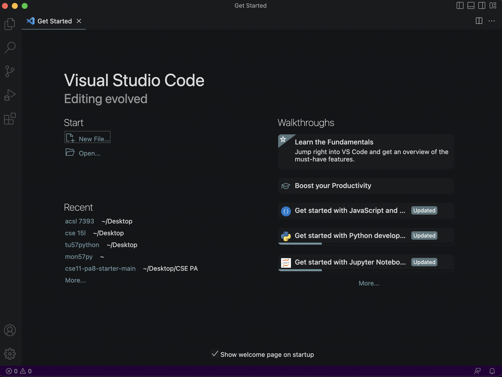
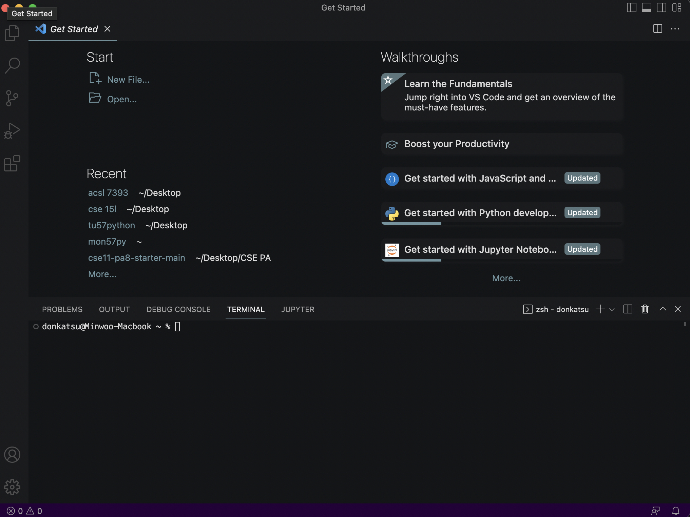
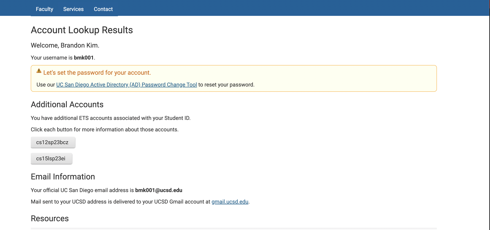
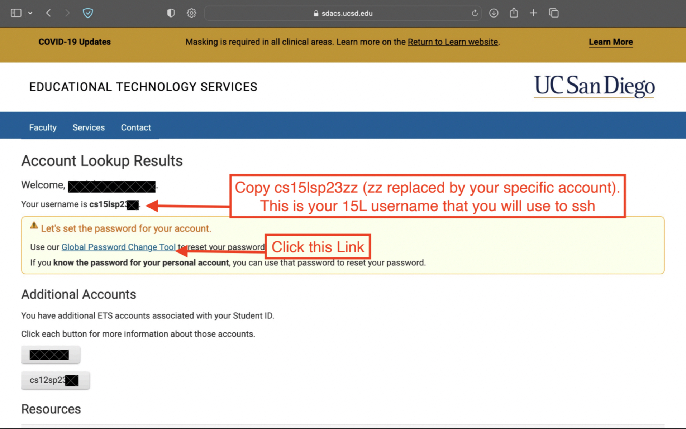
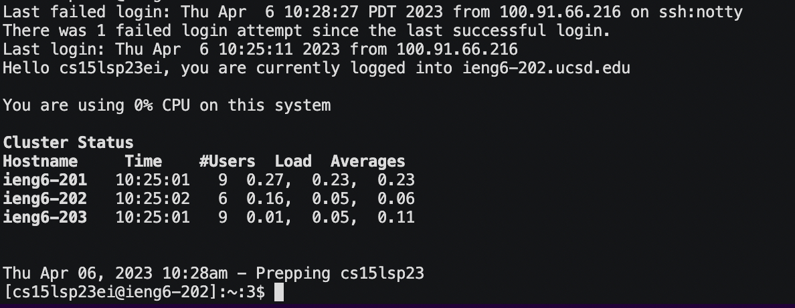

# Welcome to this epic tutorial for doing these specific three things:

- Downloading Visual Studio Code
- Remotely Connecting
- Trying some commands

## Downloading Visual Studio Code

1. First step is to goto this link: <a href="https://code.visualstudio.com/download">Download Visual Studio Code</a>
2. Select a downloading option based on your OS
3. Once it's downloaded open it up and it should look something like this:

4. Good job friend :)

## Remotely Connecting

1. Open up VS Code
2. To open the VS Code terminal, press Ctrl+\` (Windows) or Ctrl+shift+\` (Mac)
3. Once you open it, it should look something like this:

4. In order to remotely connect, you need to find your course-specific account for CSE 15L
  - Follow this link: <a href="https://sdacs.ucsd.edu/~icc/index.php">Look up account for CSE 15L</a>
  - Sign in using your UCSD username and PID and a page that looks like this should open up:
  
  
  
  - You'll see under **Additional Accounts** your course-specific username for CSE 15L

  (If you have multiple accounts, look for the one that begins with **cs15l**-

  - You will also need to set a password for that account so click on that link with your CSE 15L user
  - Click on the link labeled in this picture:
  
  
  
  - Create a new password that you will remember.
5. Now head back to the VS Code terminal
6. Using your course-specific username, type in this command:

**ssh cs15lsp23zz@ieng6.ucsd.edu**

  If this is your first time connecting remotely, this piece of text will pop up:
  
  **The authenticity of host 'ieng6.ucsd.edu (128.54.70.227)' can't be established.
  RSA key fingerprint is SHA256:ksruYwhnYH+sySHnHAtLUHngrPEyZTDl/1x99wUQcec.
  Are you sure you want to continue connecting (yes/no/[fingerprint])?**
  
  Type "yes" without the quotations
  
7. Now you should have some text on your screen that looks like this:

8. Congratulations, you just remotely connected :)

## Trying Some Commands

Now that you are remotely connected to a computer over the internet for this course you can use some commands to start looking around

- **cd \<directory\>** is a basic command that means "change directory" and it can take you to any directory you choose
- **cd \~** specifically will take you to the home directory
- **ls \<directory\>** lets you look around in the directory you used or the current directory without an argument
- **ls -lat** will let you look at all the files in your directory sorted by date
- **ls -a** will let you look at all the files in your directory including hidden files
- **ls \<directory\>** will let you look at the files in whatever directory you insert between the \<\>
- **cp \<source\> \<destination\>** will let you copy the files from whatever source to whatever destination
- **cat \<file\> \<file\> ...** will show you whatever text is stored in that file or files

## Thanks for using my tutorial :D
