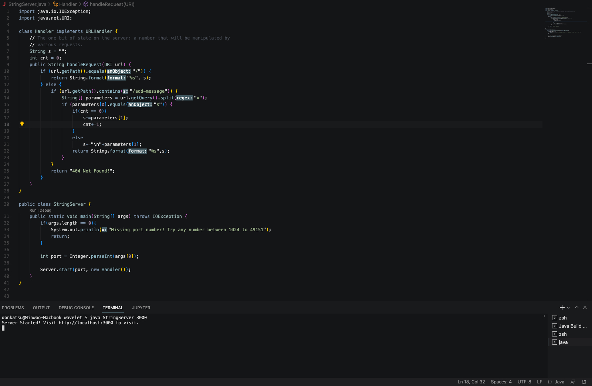
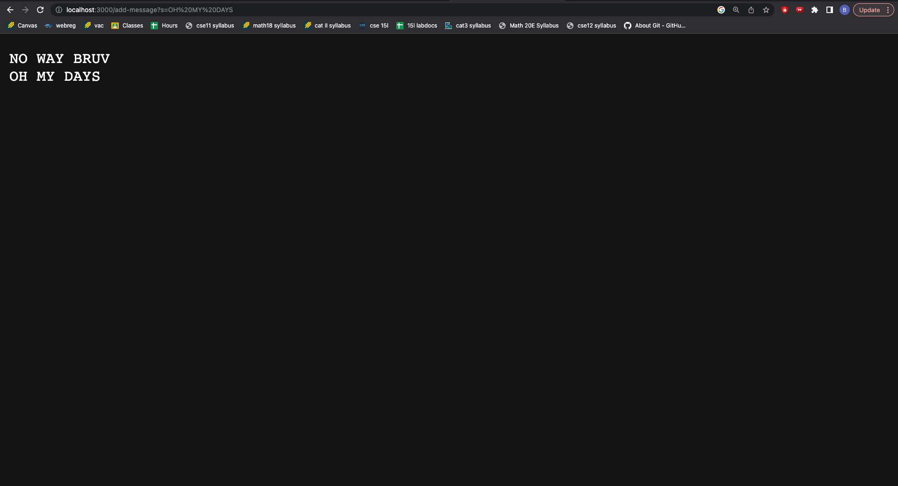

# Lab Report 2



## Part 1




In my code, when I run this the methods used are:

### handleRequest

handleRequest takes an argument of type URI. The value of String s and int cnt are relevant and change. Depending on how handleRequest handles the request, s's value could add another String value and cnt's value could increase by 1.

### getPath

getPath does not take any arguments. When getPath is called, the URI parameter is the only field that is relevant because the method reads the path based on the value of that field. The value does not change though because this method simply reads a specific segment of the String.

### getQuery

getQuery is similar to getPath and does not require any arguments but relies on the URI type parameter. This field is relevant because the method reads the query based on the value of that field. The value does not change though because this method simply reads a specific segment of the String. Although, if the query were to include an actual query value, then that value would be added to the String s value.

## Part 2

```
Hey
```

