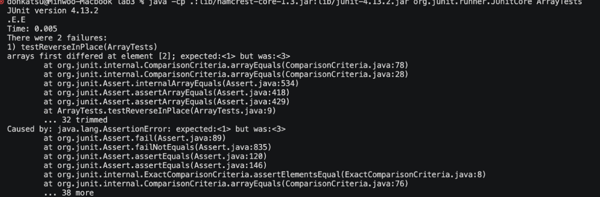
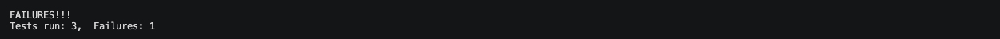

# Lab Report 2


## Part 1


In my code, when I run this the methods used are:

### handleRequest

handleRequest takes an argument of type URI. The value of String s and int cnt are relevant and change. Depending on how handleRequest handles the request, s's value could add another String value and cnt's value could increase by 1.

### getPath

getPath does not take any arguments. When getPath is called, the URI parameter is the only field that is relevant because the method reads the path based on the value of that field. The value does not change though because this method simply reads a specific segment of the String.

### getQuery

getQuery is similar to getPath and does not require any arguments but relies on the URI type parameter. This field is relevant because the method reads the query based on the value of that field. The value does not change though because this method simply reads a specific segment of the String. Although, if the query were to include an actual query value, then that value would be added to the String s value.

## Part 2

### Failure-inducing input:

```

  @Test
  public void testReversed() {
    int[] input1 = {1,2,3};
    assertArrayEquals(new int[]{0}, ArrayExamples.reversed(input1));
  }

```

### Input that doesn't induce failure:

```
  @Test
  public void testReversed() {
    int[] input1 = {0};
    assertArrayEquals(new int[]{0}, ArrayExamples.reversed(input1));
  }
```
### Output with failure-inducing



### Output with input that does not induce failure



### Before code:

```
static int[] reversed(int[] arr) {
    int[] newArray = new int[arr.length];
    for(int i = 0; i < arr.length; i += 1) {
      arr[i] = newArray[arr.length - i - 1];
    }
    return arr;
  }
```

### After code:
```
 static int[] reversed(int[] arr) {
    int[] newArray = new int[arr.length];
    for(int i = 0; i < arr.length; i += 1) {
      newArray[i] = arr[arr.length - i - 1];
    }
    return newArray;
  }
```
Bugs:

The code's main bug was misplacement of the 2 arrays. Basically, newArray was set to an array of 0s the length of arr and the for loop set the contents of arr to the reverse of newArray (which are still a bunch of 0s), and then finally printed arr. No matter what you tested, the output would always be an array with the same length as arr but full of 0s. So if the argument for arr was an array of 0s, technically the output would be correct because 0s reversed is 0s. This is why the test case {0} worked. This is also why the test case {1,2,3} did not work. It was supposed to output {3,2,1} but it outputs {0,0,0}.

How I fixed the bugs:

To fix the code, I understood that the reason newArray was initialized was to contain the contents of the reversed array so instead of arr changing its contents, I changed the contents of newArray. Also, the numbers that needed to be reversed were from arr not newArray, so I changed newArray[arr.length - i - 1] to arr[arr.length - i - 1]. Then lastly, I returned newArray because returning arr would just return the input.


## Part 3

I didn't know I could code a website using Java like that. I've made html websites with css and JavaScript but using Java with its object-oriented stuff is cool. 


