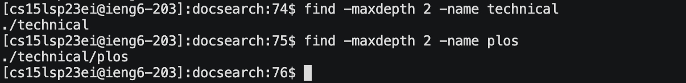
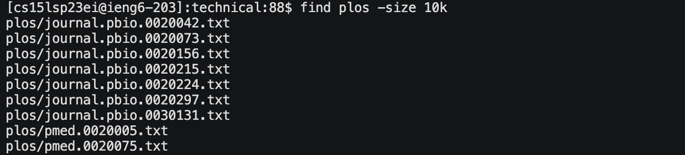
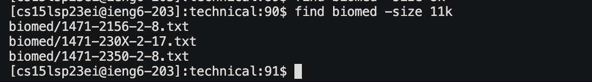
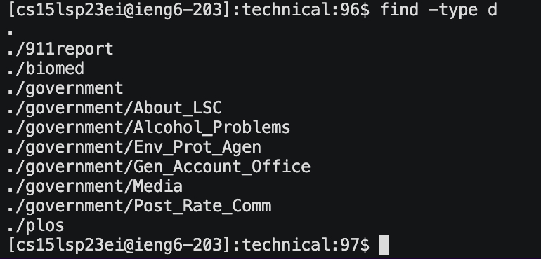
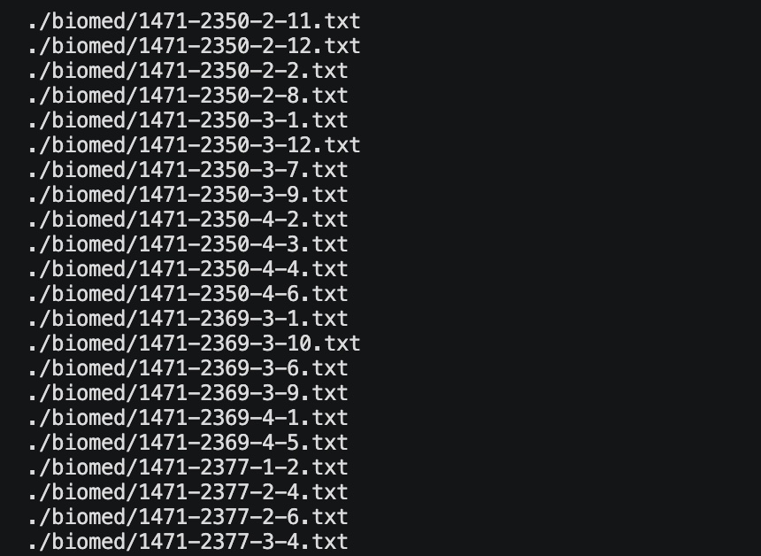
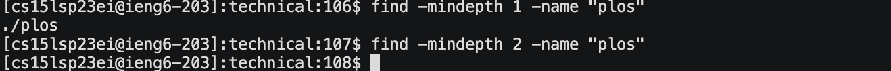

# Find Options

## 1. -maxdepth - https://man7.org/linux/man-pages/man1/find.1.html

In the first use of maxdepth, from docsearch, the command searches at most 2 levels deep for -name technical. Levels are synonomous with directories so the command is traversing through 2 directories max trying to find -name technical. It prints the path to what was found. 

In the second use of maxdepth, from docsearch, the command still looks at most 2 levels deep beneath docsearch to find -name plos. Technical is 1 level beneath docsearch and plos is 2 levels beneath docsearch which was why it was able to be found with maxdepth level 2.

-maxdepth is useful because you might only know the general area you need to look in for whatever it is you're trying to find. You can just search each level of directories for N levels even though you don't know anything but whatever pattern you are trying to find.

## 2. -size - https://pimylifeup.com/find-command/#findbysize

In the first use of size, from technical, the command searches for any file with size 10 kilobytes within the plos directory. It displays all the files with size 10 kilobytes.

In the second use of size, from technical, the command searches for any file with size 11 kilobytes within the biomed directory. It displays all the files with size 11 kilobytes.

-size is useful because you might need to do some quality control. See how many files match the size you're looking for. You can also put a (+/-) before the number to view which files are greater than or lesser than a size because maybe you can only work with a certain size of file or files that are at least a certain size or at most a certain size.

## 3. -type - https://www.computerhope.com/unix/ufind.htm

In the first use of type, the command searches for anything of type d which means directory. The command prints all directories found from technical.

In the second use of type, I did find -type f. The command searches for anything of type f which means regular files. I can't show all the files because there are a lot but the command printed every file found in technical.

-type is useful because you can see a nice list of each query. There are a few other useful fields like b which are block (buffered) special files. So it's similar to ls but it compiles a neat list.

## 4. -mindepth - https://man7.org/linux/man-pages/man1/find.1.html

In the first use of mindepth, I used find -mindepth 1 -name "\*.txt". This command basically skipped past the technical directory (1st level) which had plos, biomed, etc. and looked within each of those directories to find every file that ended in ".txt". 

In the second and third use of mindepth, I changed the minimum level. I didn't skip any levels using mindepth 1 so it was able to find plos which was in the technical directory. However, when I used mindepth 2, the command skipped level 2 which had plos in it and looked through plos, biomed, etc. to find anything with the name "plos" which it couldn't.

-mindepth is useful because you can literally search every possible available directory within a directory to find anything with a specific name or pattern by just specifying a minimum level of search. You can also skip past any levels of directories that you know will not contain what you are looking for.
