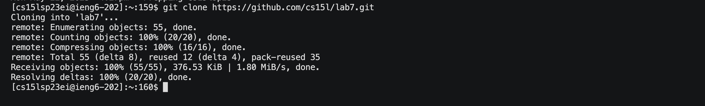
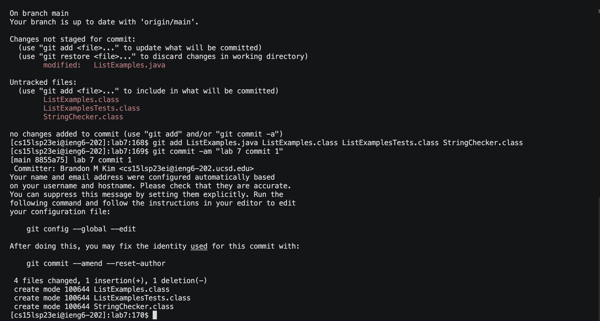

# Lab Report 4

I pressed \<up\> once to login to ieng6 because I already had used it just before.

I went into GitHub to fork the repository then I copied the html link and cloned it in the command line

I then ran the code sh tests.sh to run the tests to show they fail

To edit the code I typed vim ListExamples.java. \<q\> until at the line needed to be fixed. \<l\>\<l\>\<l\>\<l\>\<l\>\<l\>\<l\>\<l\>\<l\>\<l\>\<l\>\<x\>\<i\>. The \<l\> presses allowed me to navigate to the right to put the cursor on the 1 character. The press of \<x\> allowed me to delete the 1 character and then I typed 2 to insert after pressing \<i\> which allowed me to insert 2 where it is supposed to be. \<esc\>. Then I typed :wq to exit and save my changes.

I then ran sh tests.sh once more to confirm the tests passed pressing \<up\> once back in history

Then I checked git status to see which files I needed to add, git add the files on to the staging area, git commit -am "lab 7 commit", and then git push which I then was prompted to log into GitHub.
  

  
  

