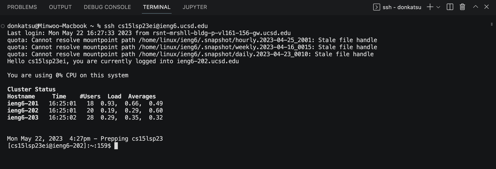
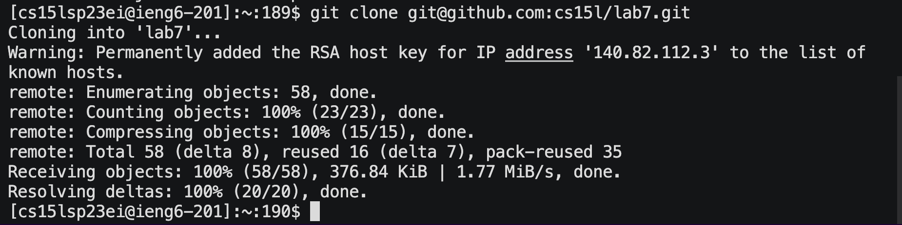
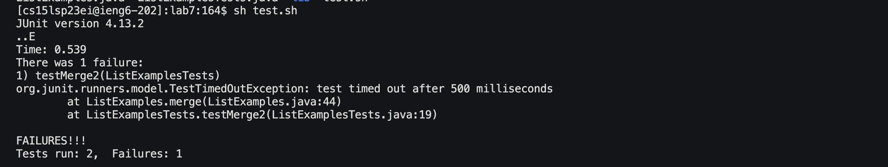
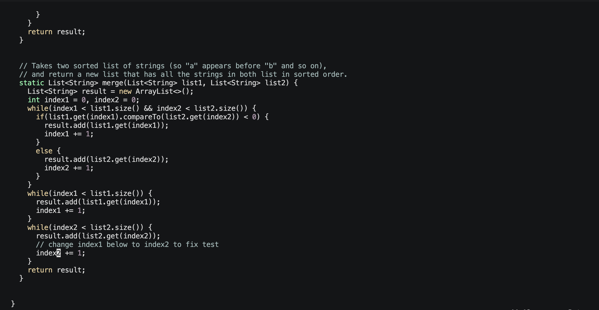
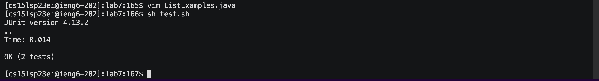
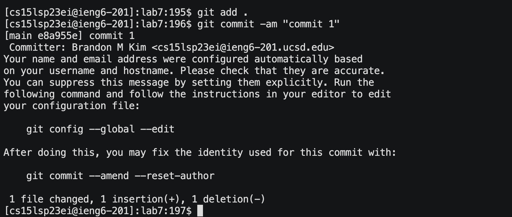
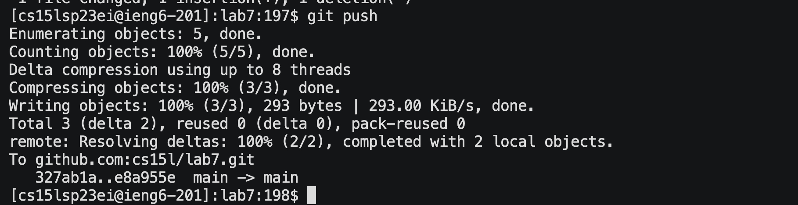

# Lab Report 4


## Step 4: Log into ieng6



```
<up>
<enter>
```

I pressed \<up\> once to login to ieng6 because I already had used it just before.

## Step 5: Clone your fork of the repository from your Github account



I went into GitHub to fork the repository then I copied the SSH link and cloned it in the command line

## Step 6: Run the tests, demonstrating that they fail



I then ran the code sh tests.sh to run the tests to show they fail

## Step 7: Edit the code file to fix the failing test



```
<l><l><l><l><l><l><l><l><l><l><l>
<x>
<i>
<2>
<esc>
```

To edit the code I typed vim ListExamples.java. \<q\> until at the line needed to be fixed. \<l\>\<l\>\<l\>\<l\>\<l\>\<l\>\<l\>\<l\>\<l\>\<l\>\<l\>\<x\>\<i\>. The \<l\> presses allowed me to navigate to the right to put the cursor on the 1 character. The press of \<x\> allowed me to delete the 1 character and then I typed 2 to insert after pressing \<i\> which allowed me to insert 2 where it is supposed to be. I then pressed \<esc\> to exit the insert mode. Then I typed :wq to exit and save my changes.

## Step 8: Run the tests, demonstrating that they now succeed



```
<up>
<enter>
```

I then ran sh tests.sh once more to confirm the tests passed pressing \<up\> once back in history

## Step 9: Commit and push the resulting change to your Github account




I used the command git add . to add all the files that were untracked,tracked, and changed on to the staging area, git commit -am "commit 1", and then git push which ran successfully.
  

  
  

