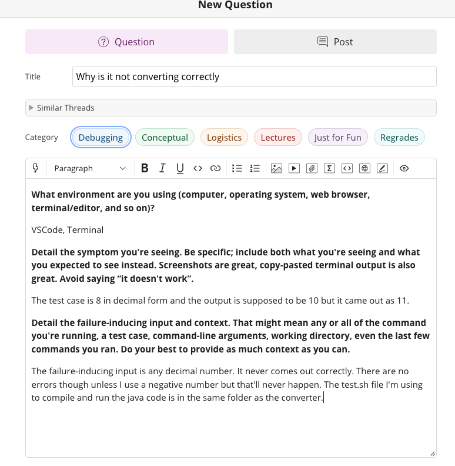

# Lab Report 5


# 1. Debugging Scenario (Decimal to Octal Base Converter)




# 2. Response from TA

It seems your logic for the Decimal to Octal conversion is a little off or maybe you just made a mistake. I believe in your convertToOctal method's while loop,
your variable i is keeping track of the unit being added to the octal number (ones, tens, hundreds) and instead of multipling by 10 to get the next unit,
you are adding 10. It seems possible that this was a simple mistake considering i starts as 1 and not 0.

Hopefully this helps! And if you have any more issues, please take advantage of office hours so that we can help you debug if necessary!

# 3. Response from Student


Thank you! I fixed the bug by changing i += 10 to i \*= 10. It finally works now!

The bug was simply that the variable that was in charge of determining what unit to add to the octal value was not scaling correctly.
It was changing 1 - 11 - 21 - 31
When it should have been 1 - 10 - 100 - 1000
This is why when I put the input 64 I got 21 instead of 100.

# File and Directory
```
report 5
  - test.sh
  - DecimalToOctalConverter.java
  - DecimalToOctalConverter.class
  ```

# Contents of each file before the fix

## DecimalToOctalConverter.java:

```
public class DecimalToOctalConverter {
    public static int convertToOctal(int decimal) {
        int octalNumber = 0;
        int remainder;
        int i = 1;

        while (decimal > 0) { 
            remainder = decimal % 8;
            octalNumber += remainder * i;
            decimal /= 8;
            i += 10;
        }

        return octalNumber;
    }

    public static void main(String[] args) {
        int decimalNumber = 64; // Test case
        int octal = convertToOctal(decimalNumber);
        System.out.println("Octal representation of " + decimalNumber + " is: " + octal);
    }
}
```

## test.sh

```
javac DecimalToOctalConverter.java
java DecimalToOctalConverter
```
# Commands run to trigger the bug

```
sh test.sh
```

# Description of what to edit to fix the bug

The variable i represents the placement of each octal digit which should be (1,10,100,1000) but it was going (1,11,21,31) which hardly makes any sense.
Change how much i scales by. Instead of adding 10 to i, multiply 10 to i. This is in the while loop in the convertToOctal method.

# Part 2: Reflection

I learned a lot of cool things in this lab actually. Lab-related, I learned about vim. I always saw it being used but never actually knew what it did.
I am also actually working on an app right now and literally during the weeks we were learning git command line, I needed to use it to merge my work with
my team's. It was the first time I experienced using something I learned from school towards a real-life application. And I also learned grades matter even
for a CS major.
